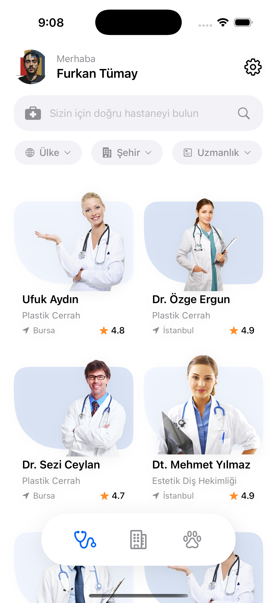
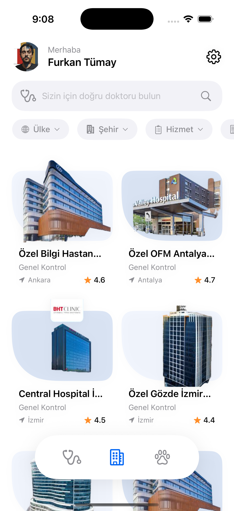
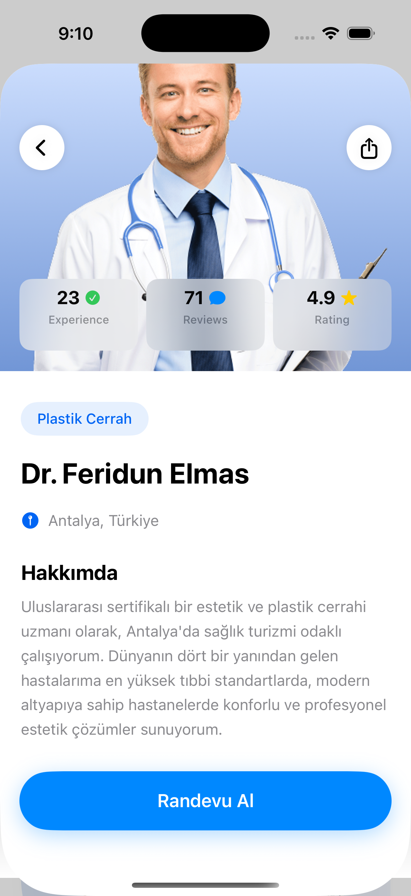
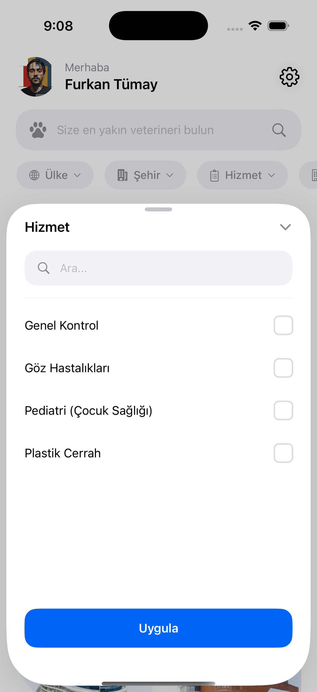
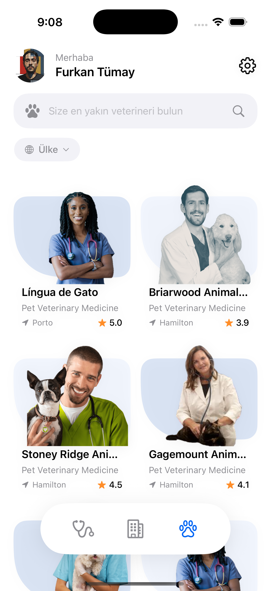
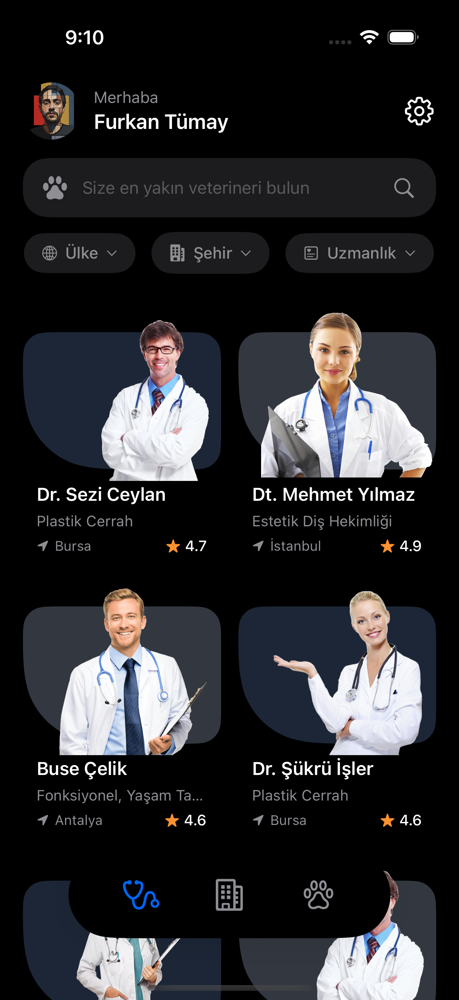
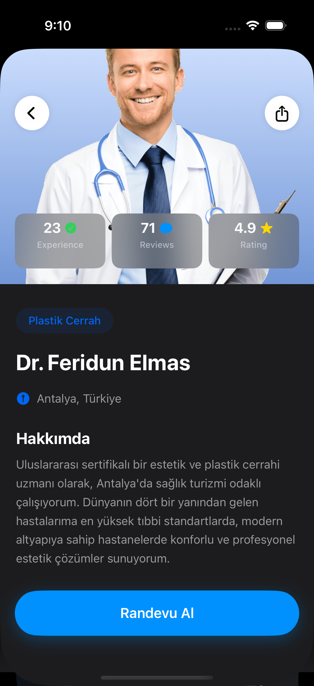

# 🩺 MediFinder

MediFinder; doktor, hastane ve veteriner gibi sağlık hizmeti sağlayıcılarını kolayca bulmayı, filtrelemeyi ve yönetmeyi sağlayan modern bir iOS uygulamasıdır.

---

## 📱 Uygulama Ekran Görüntüleri (Screenshots)

| splash.png | light1.png | light2.png | light3.png |
| :---: | :---: | :---: | :---: |
|  |  |  |  |
| **light4.png** | **light5.png** | **dark1.png** | **dark2.png** |
|  |  |  |  |

---

## 🎬 Uygulama Demo Videosu

Uygulamanın tüm özelliklerini, akışını, filtreleme detaylarını ve dinamik dil geçişlerini canlı olarak görmek için aşağıdaki görsele veya bağlantıya tıklayarak YouTube Shorts videomuzu izleyebilirsiniz:

<p align="center">
  <a href="https://youtube.com/shorts/QDc9xFe-A9E" target="_blank">
    
  </a>
</p>

<p align="center">
  ▶️ <b><a href="https://youtube.com/shorts/QDc9xFe-A9E" target="_blank">MediFinder Demo Videosunu İzlemek İçin Tıklayın</a></b>
</p>

---

## 🏗️ Mimari Tercihler & Tasarım

Uygulama, sürdürülebilir, test edilebilir ve genişletilebilir bir kod tabanı oluşturmak amacıyla modern iOS standartlarına uygun olarak mimarize edilmiştir.

* **MVVM Mimarisi:** `View`, `ViewModel` ve `Model` katmanları net bir şekilde birbirinden soyutlanmıştır. `ViewModel`; JSON formatındaki dummy (taslak) verilerin yüklenmesi, arama, filtreleme ve sayfalama (pagination) gibi temel iş mantıklarını (business logic) yönetir.
* **SwiftUI Bileşen Yaklaşımı:** Görsel ve etkileşimli tüm parçalar modüler bir yapıda tasarlanmıştır. Ortak UI elemanları ayrı bileşenler olarak soyutlanarak kod tekrarının önüne geçilmiştir.
    * *Kullanılan Başlıca Komponentler:* `CustomSearchBar`, `FilterChipsBar`, `FloatingTabBar`, `ProviderGridCard`, `FilterDropdown`, `CustomNavigationBar`.

---

## 🔄 State (Durum) Yönetimi

* **Modern Observation API:** Uygulama genelinde veri akışı ve durum yönetimi için SwiftUI’ın güçlü `@Observable` ve `@Environment` makroları kullanılmıştır. 
* **Tek Kaynaktan Yönetim (Single Source of Truth):** `ViewModel` ve `LanguageManager` çevre birimi (environment) olarak enjekte edilmiştir. Arama metni, seçili filtreler, aktif tab alanı ve sayfalama durumları tek bir `ViewModel` üzerinden kontrol edilir; View'lar yalnızca bu durumları UI'a yansıtır.

---

## 📁 Kod Organizasyonu

Proje, okunabilirliği artırmak ve ekip çalışmasına uygun hale getirmek için katı bir klasörleme yapısına sahiptir:

* **View /:** Ekran bazlı ana arayüz dosyaları.
* **Components /:** Küçük, tek bir sorumluluğa sahip (single-responsibility) ve yeniden kullanılabilir UI bileşenleri.
* **ViewModel /:** İş mantığının ve state yönetiminin döndüğü katman.
* **Model /:** Veri yapılarının ve JSON eşlemelerinin bulunduğu katman.

---

## 🗺️ Navigasyon ve Akış Kurgusu

* **Ana Akış (HomePage):** Uygulama merkezi bir `HomePage` üzerinden yönetilir. Ekranın alt kısmında `Doctor`, `Hospital` ve `Vet` (Veteriner) olmak üzere 3 ana tab alanı yer alır.
* **Dinamik Filtreleme:** Her tab alanı kendine ait kategori filtrelerini tetikler. Gelişmiş filtreleme seçenekleri, ekranın altından açılan (`sheet`) `FilterDropdown` bileşeni üzerinden seçilir.
* **Detay ve Ayarlar:** Sağlık sağlayıcılarının detayları (`ProviderDetailView`) ve uygulama ayarları (`SettingsView`) kullanıcı deneyimini bozmamak adına `sheet` (modal) olarak sunulur.

---

## 🌐 Dil ve Yerelleştirme (Localization)

* **Dinamik Dil Yönetimi:** `LanguageManager` aracılığıyla uygulama içi dil (İngilizce / Türkçe) tamamen dinamik olarak yönetilir. `SettingsView` üzerinden dil değiştirildiği anda tüm UI anında güncellenir.
* **Esnek Metin Yapısı:** `FilterChipsBar` metinleri ve `FilterDropdown` başlıkları Text tabanlı yerelleştirme ile çalışır.
* **Özel Placeholder Yönetimi:** `CustomSearchBar` üzerindeki arama ipuçları (placeholder), `LanguageManager.currentLanguage` durumuna göre çalışma zamanında (runtime) dinamik olarak İngilizce veya Türkçe olarak döndürülür.

---

## 🛠️ Hata ve Veri Yönetimi

### 🔍 Null / Eksik Veri Yönetimi
* JSON verisinden gelebilecek boş veya eksik alanlar için güvenli `if let` ve `optional` kontrolleri uygulanmıştır.
* Eksik veri durumlarında kullanıcıya boş kalmış bir ekran yerine, amaca uygun placeholder metinler ve görseller gösterilir.

### 🔄 UI Durumları (State Handling)
* **Loading (Yükleniyor):** İlk veri çekme anında ve sayfalama esnasında kullanıcıya `ProgressView` ile görsel geri bildirim sağlanır.
* **Empty (Boş Sonuç):** Arama veya filtreleme sonucunda eşleşen veri bulunamazsa ekranda *"No Results Found"* uyarısı ve filtreleri sıfırlayan *"Clear All Filters"* butonu belirir.
* **Error (Hata):** Olası bir yükleme hatasında kullanıcı bilgilendirilir ve süreci yeniden başlatacak bir *"Retry"* (Yeniden Dene) akışı sunulur.

---

## ⚙️ Kurulum ve Çalıştırma

Projeyi yerel ortamınızda çalıştırmak için aşağıdaki adımları izleyebilirsiniz:

1.  **Gereksinimler:** Xcode 15+ veya Xcode 16+ sürümünün yüklü olduğundan emin olun.
2.  **Projeyi Klonlayın:**
    ```bash
    git clone [https://github.com/kullaniciadi/MediFinder.git](https://github.com/kullaniciadi/MediFinder.git)
    ```
3.  **Çalıştırın:** Projeyi Xcode ile açın, hedef cihazı seçin ve `Cmd + R` kısayolu ile derleyip çalıştırın. Uygulama, gömülü gelen dummy JSON verilerini otomatik olarak yükleyecektir.
